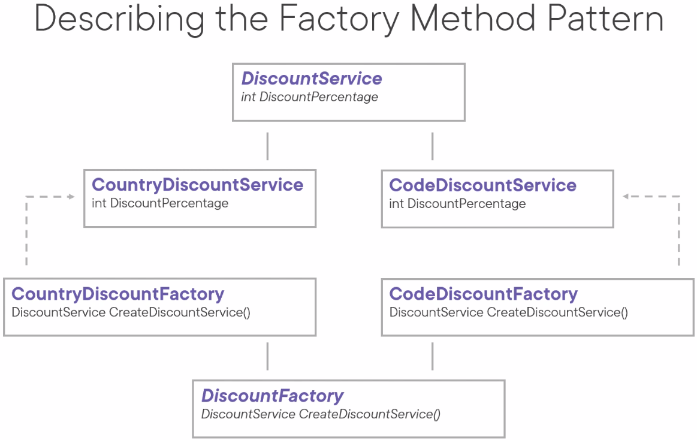

# Factory Method Pattern
The intent of the factory method pattern is to define an interface for creating an object, but to let subclasses decide which class to instantiate. Factory method lets a class defer instantiation to subclasses.



- Product & creator be implemented as an interface or abstract class
- Eliminates the need to bind application-specific classes to your code
- Also known as a virtual constructor
- Not to be confused with the Abstract factory pattern
- Example of a problem that this pattern can solve:
````
var codeDiscountService = new CodeDiscountService(Guid.NewGuid());
var discount = codeDiscountService.DiscountPercentage;

// or

var countryDiscountService = new CountryDiscountService("AU");
var discount = countryDiscountService.DiscountPercentage;
````
- All the client cares about in the example above is the DiscountPercentage, having to use if/switch statements to then manually new up the correct discount service tightly couples client code to implementation.

Use cases:
- When a class can't anticipate the class of objects it must create
- When a class wants its subclasses to specify the objects it creates
- When classes delegate responsibility to one of several helper subclasses, and you want to localize the knowledge of which subclass is the delegate.
- As a way to enable reusing of existing objects

Pattern consequences:
- Factory methods eliminate the need to bind application specific classes to your code (avoiding tight coupling)
- Adheres to open/closed principle (OCP); new types of products can be added without breaking client code
- Adheres to single responsibility principle (SRP); creating products is moved to one specific place in your code, the creator
- Disadvantage is that clients might need to create subclasses of the creator class just to create a particular ConcreteProduct object

Related patterns:
- Abstract factory; often implemented with factory methods
- Prototype; no subclassing is needed (not base on inheritance), but an initialize action on Product is often required
- Template; factory methods are often called from within template methods