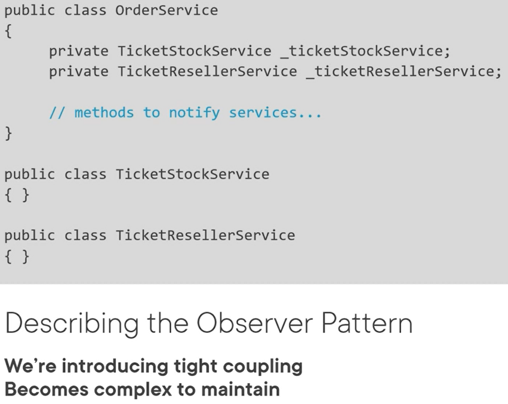
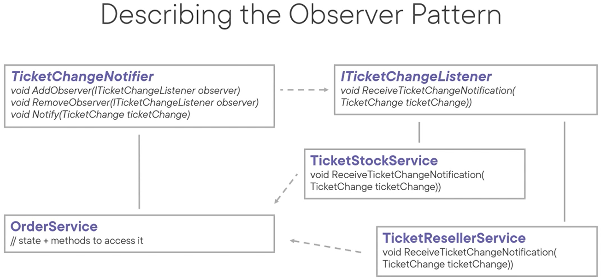
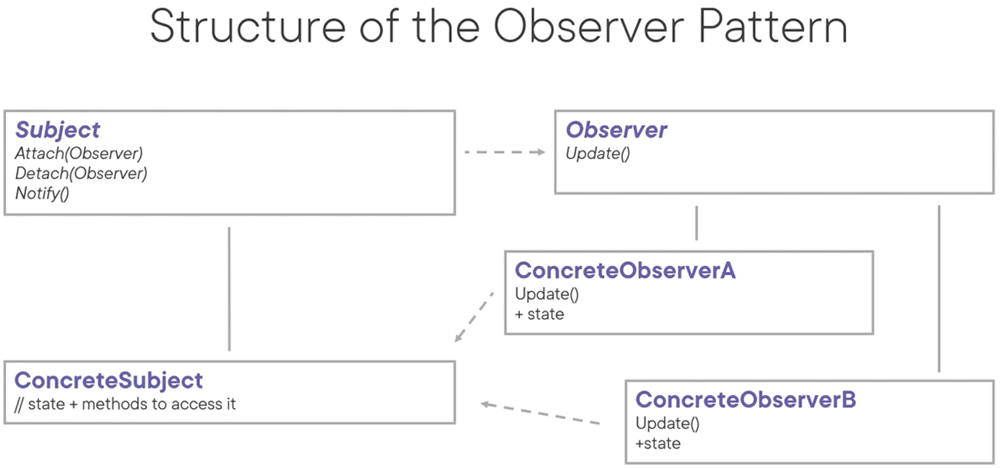

# Observer (PubSub) Pattern
The intent of this pattern is to define a one to many dependency between obejcts so that when one object changes state, all its dependents are notified and updated automatically.

Use cases:
- When a change to one object requires changing others, and you don't know in advance how many objects need to be changed.
  - Common in microservices architectures where services that need to be notified can change dynamically.
- When objects that observe others are not necessarily doing that for the total amount of time the application runs
- When an object should be able to notify other objects without making assumptions about who those objects are

Pattern consequences:
- OCP: it allows subjects and observers to vary independently: subclasses can be added and change without having to change others
- OCP: subject and observer are loosely coupled
- It can lead to a cascade of unexpected updates

Patterns that connect senders and receivers:
- Chain of Responsibility: passes a request along a chain of receivers
- Command: connects senders with receivers unidirectional (e.g. button in UI)
- Mediator: eliminates direct connections altogether
- Observer: allows receivers of requests to (un)subscribe at runtime