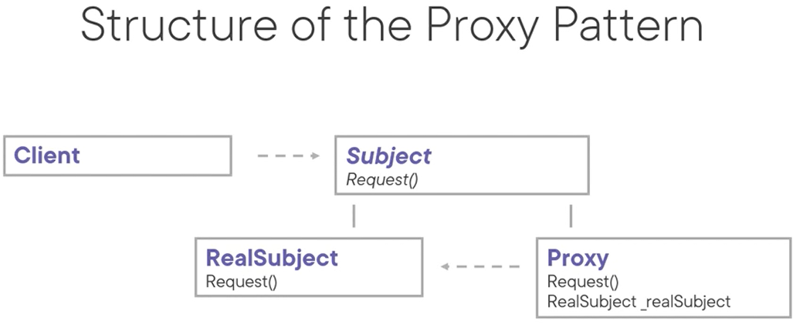

# Proxy Pattern
Also known as a **surrogate** or **placeholder** pattern.

The intent of this pattern is to provide a surrogate or placeholder for another object to control access to it (access control).

- Example: Remote Proxy
  - Accessing a remote API from an application; proxy is responsible for controlling the actual access to the remote API
  - Provides an interface identical to the actual call (although this is sometimes diverted from... but if the interface is changed it is more like an adapter pattern)
  - Proxy can take on responsibility of executing code before or after calling the API

Proxy provides an interface identical to the **Subject**. It maintains a reference to and controls access to the **RealSubject**.

Variations of the Proxy Pattern:
- Remote Proxy: client can communicate with the proxy, feels like local resource
- Virtual proxy: allows creating expensive objects on demand (a stand in for an object that is expensive to create)
- Smart proxy: allows adding additional logic around the subject (examples: managing caching or locking access to shared resources)
- Protection proxy: used to control access to an object (authorization)

Separation between these types isn't always clear. Sometimes proxies will do multiple of these roles even if that is violation of SRP. A better approach would be to chain proxies when multiple variations are required for your use case.

Use cases:
- Remote proxy: when you want to provide a local representative
- Virtual proxy: when you only want to create expensive objects on demand
- Smart proxy: when you're in need of a caching or locking scenario
- Protection proxy: when objects should have different access rules

Pattern consequences:
- Remote proxy: hides the fact an object resides in a different network space
- Virtual proxy: the object can be created on demand
- Smart proxy: additional housekeeping tasks can be executed when an object is accessed
- Protection proxy: additional housekeeping tasks can be executed when an object is accessed
- OCP: it allows introducing new proxies without changing client code
- Added complexity because of additional classes
- Performance impact of passing through additional layers

Related patterns:
- Adapter: adapter provides a different interface, proxy provides the same interface
- Decorator: decorator adds responsibilities to an object, while proxy controls access to an object
