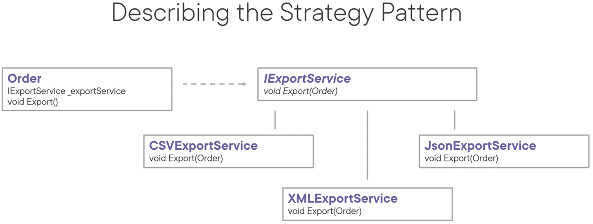
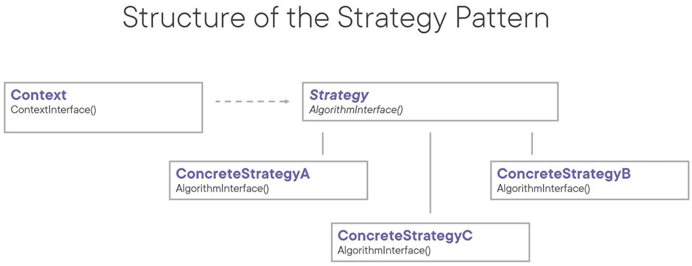

# Strategy Pattern
The intent of this pattern is to define a family of algorithms, encapsulate each one, and make them interchangeable. Strategy lets the algorithm vary independently from clients that use it.

Use cases:
- When many related classes differ only in their behavior (and not interface)
- When you need different variants of an algorithm which you want to be able to switch at runtime
- When your algorithm uses data, code or dependencies that the clients shouldn't know about
- When a class many different behaviors which appears as a bunch of conditional statements in its method

Pattern consequences:
- It offers an alternative to subclassing your context
- OCP: new strategies can be introduced without having to change the context
- It eliminates conditional statements
- It can provide a choice of implementations with the same behavior
- If the client injects the strategy, it must be aware of how strategies differ
- There's overhead in communication between the strategy and the context
- Additional objects are introduced, which increases complexity

Related patterns:
- Flyweight: strategy objects make good flyweights
- Bridge: also based on composition, but solves a different problem
- State: also based on composition, but solves a different problem
- Template method: template method allows varying part of an algorithm through inheritance: a static approach. Strategy allows behavior to be switched at runtime, via composition: a dynamic approach.