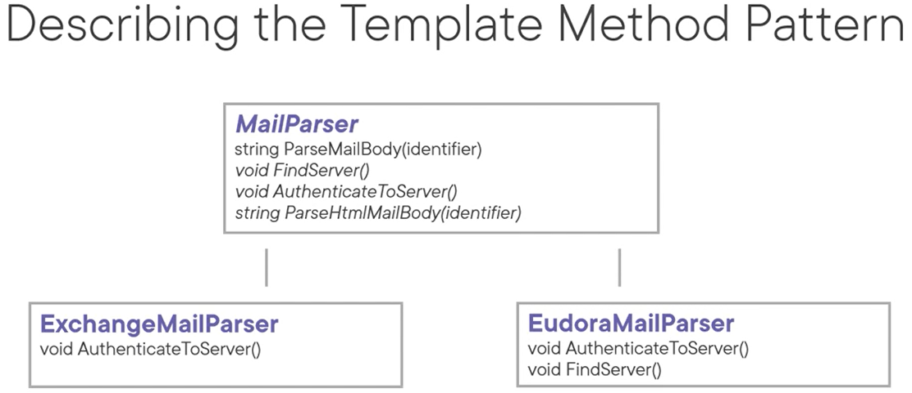

# Template Pattern
The intent of this pattern is to define the skeleton of an algorithm in an operation, deferring some steps to subclasses. It lets subclasses redefined certain steps of an algorithm without changing the algorithm's structure.

Implementation:
- Define the template method on the abstract class and don't allow overriding it
- Mark methods that differ per subclass as abstract
- Mark methods that differ for some subclasses as virtual

Use cases:
- When you want to implement invariant parts of an algorithm only once, and want to leave it to subclasses to implement the rest of the behavior
- When you want to control which part of an algorithm subclasses can vary
- When you have a set of algorithms that don't vary much

Pattern consequences:
- Template methods are a fundamental technique for code reuse
- Template methods cannot be changed: the order of the methods they call is fixed

Related patterns:
- Factory method: factory method can be viewed as a specialization of template method. Template methods often use factory methods as part of their skeleton structure.
- Strategy: Template method allows varying part of an algorithm through inheritance: a static approach. Strategy allows behavior to be switched at runtime, via composition: a dynamic approach.