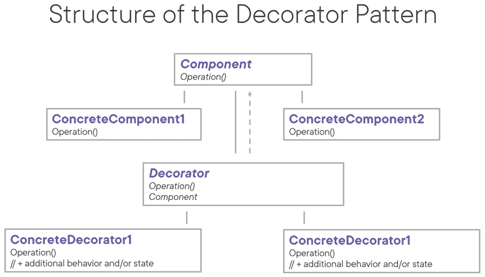

# Decorator Pattern
The intent of this pattern is to attach additional responsibilities to an object dynamically. A decorator thus provides a flexible alternative to subclassing for extending functionality.

Just like the adapter pattern, this pattern is sometimes called a **wrapper**.

Use cases:
- When you have a need to add responsibilities to individual objects dynamically (at runtime) without affecting other objects.
- When you need to be able to withdraw or change responsibilities you attached to an object.
- When extension by subclassing is impractical or impossible (for example if the class is sealed).

Pattern consequences:
- More flexible than using static inheritance via subclassing: responsibilities can be added and removed at runtime ad hoc.
- SRP: you can use the pattern to split feature-loaded classes until there's just one responsibility left per class.
- Increased effort is required to learn the system due to the amount of small, simple classes.

Related patterns:
- Adapter: adapter gives a new interface to an object, decorator only changes its responsibilities
- Composite: adapter can be seen as a composite with only one component.